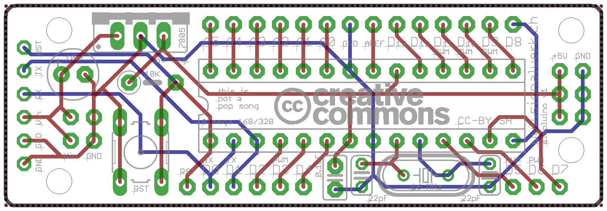
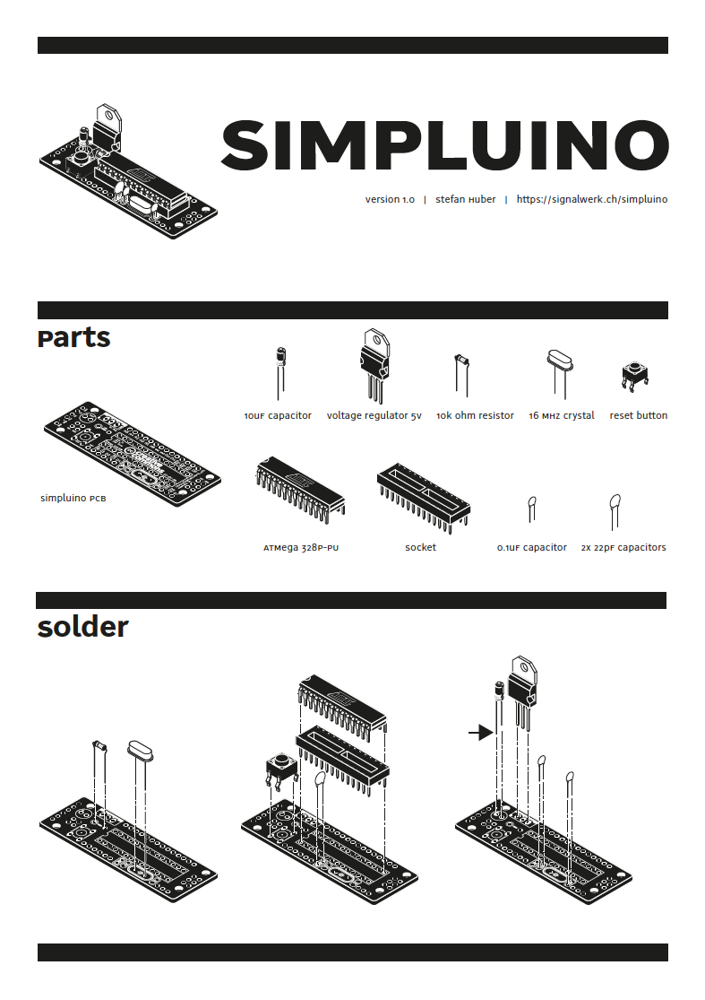

## simpluino
Version 1.0 (2012)

The files for the PCB layout are designed in [EAGLE (Software)](https://www.cadsoftusa.com/).
In the folder «production» you can find the output to Gerber.

### Attention!
Only connect the FTDI if you are not connected to other power sources!
If you like to upload a sketch with FTDI press the reset button just before the 
IDE starts to upload the code. Otherwise you will get an error code like:
avrdude: stk500_recv(): programmer is not responding

### Latest Version
https://github.com/signalwerk/simpluino

### Feature
* All Power-Pins and all Output-/Input-Pins fit for Breadboards (if needed)
* Minimal Arduino-Clone-Board with 16 MHz Crystal and Reset-Switch
* Mounting holes (bit small but still there)
* Smal dimension (63.8mm x 21.6mm)
* 6 Pin for FTDI-Connector (no Power-Jumpers, no auto-reset)
* Two layers PCB
* Silkscreen on the front and back

### Parts to Build the simpluino
* 1× simpluino PCB
* 1× ATmega 168P or ATMega 328P-PU
* 1× 16 MHz crystal (speed up the ATmega)
* 1× Voltage regulator 5V (volatage regulation)
* 1× 10uF capacitor (volatage regulation)
* 1× 0.1uF capacitor (decoupling capacitor)
* 1× 10k ohm resistor (pull up resistor for RESET)
* 2× 22pF capacitors (crystal)

#### optional
* Switch (reset)
* 28pin socket adaptor (swap ATmega)
* Header-Pins (swap connections)

### Possible Modifications
* Take a 5V 78L05 Voltage regulator to save space

### ToDo for Version 2
* 10uF capacitor between the RST and the FTDI-Headers for perform auto-reset

### Licence
[Creative Commons — Attribution-ShareAlike 3.0 - CC BY-SA 3.0](http://creativecommons.org/licenses/by-sa/3.0/)

### Based on the following Boards
* [Boarduino](http://www.ladyada.net/make/boarduino/)
* [Gorduino](http://thetransistor.com/projects/gorduino/)
* [Project Board](http://www.kickstarter.com/projects/610437050/arduino-project-board)

### Reviews
* [Robert Patterson](http://www.CrossRoadsFencing.com) showed me a lot of things I have to consider to build an arduino clone.
* [Arduino Forum](http://arduino.cc/forum/index.php/topic,69466.0.html)

### Infos for Arduino-Clones and PCB design
* [De-coupling](http://www.thebox.myzen.co.uk/Tutorial/De-coupling.html)
* [Better PCBs in Eagle](http://www.sparkfun.com/tutorials/115)

### PCB-Design
"Always vector font" in the "User Interface" dialog should always be on for anything to be output to Gerber.
If the ground plane does not appear, click the Ratsnest button on the sidebar. 

